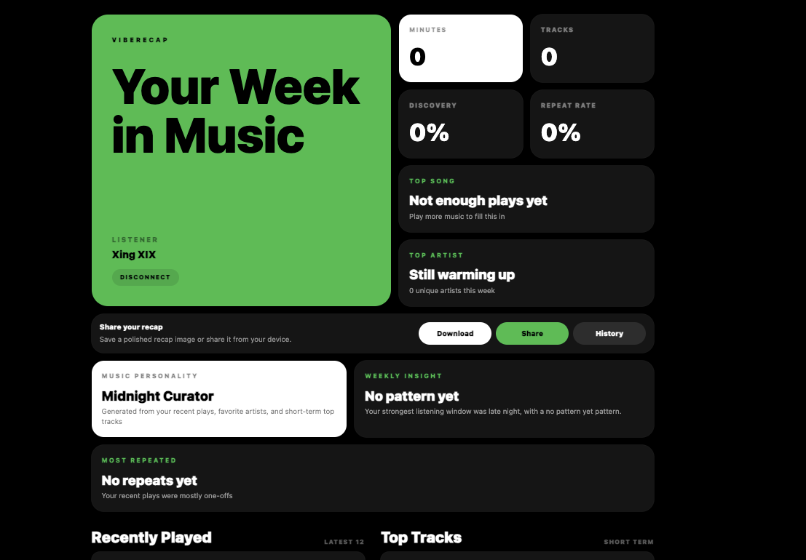

<div align="center">

# Recap

### Your weekly music identity, beautifully recapped.

Recap is a personal Spotify recap app that transforms your recent listening activity, top tracks, favorite artists, and music patterns into a clean weekly recap experience.

<br />



<br />

</div>

---

## About The Project

**Recap** is a mobile-first music recap app built for people who want to see their music personality more often than once a year.

Instead of waiting for Spotify Wrapped, Recap lets users connect their Spotify account and instantly generate a beautiful weekly recap based on their latest listening activity.

The app currently works as a Spotify MVP and is designed to later support more music platforms.

---

## Core Features

- Connect Spotify account securely
- Fetch recently played tracks
- Fetch short-term top tracks
- Fetch short-term top artists
- Estimate listening minutes
- Generate music personality
- Show weekly music insight
- Save recap history locally
- View a polished Spotify Wrapped-inspired recap UI

---

## App Flow

```txt
Open Recap
      ↓
Connect Spotify
      ↓
Authorize account
      ↓
Fetch listening data
      ↓
Generate recap
      ↓
View weekly music summary
      ↓
Save or share recap
```

---

## Tech Stack

| Area | Technology |
|---|---|
| Frontend | Vite + React |
| Styling | Tailwind CSS |
| Routing | React Router |
| Animation | Framer Motion |
| Music Data | Spotify Web API |
| Auth Flow | Spotify OAuth with PKCE |
| Storage | LocalStorage |

---

## Screens

### Landing Page

A simple, bold introduction screen with a clear Spotify connection button.

### Dashboard

Fetches listening data from Spotify and generates a weekly recap.

### Weekly Recap

Displays the user’s music week with:

- Top song
- Top artist
- Estimated listening minutes
- Tracks analyzed
- Discovery rate
- Repeat rate
- Music personality
- Weekly insight
- Recently played tracks
- Top tracks

### Recap History

Stores previous recap summaries locally on the device.

---

## Project Structure

```txt
Recap/
│
├── frontend/
│   ├── src/
│   │   ├── components/
│   │   │   ├── ArtistCard.jsx
│   │   │   ├── Loading.jsx
│   │   │   ├── RecapCard.jsx
│   │   │   └── SongCard.jsx
│   │   │
│   │   ├── lib/
│   │   │   ├── auth.js
│   │   │   ├── config.js
│   │   │   ├── recap.js
│   │   │   └── spotify.js
│   │   │
│   │   ├── pages/
│   │   │   ├── Callback.jsx
│   │   │   ├── Dashboard.jsx
│   │   │   ├── Landing.jsx
│   │   │   └── WeeklyRecap.jsx
│   │   │
│   │   ├── App.jsx
│   │   ├── index.css
│   │   └── main.jsx
│   │
│   ├── index.html
│   ├── package.json
│   └── vite.config.js
│
├── backend/
│   └── experimental YouTube Music files
│
├── .gitignore
└── README.md
```

---

## Spotify Setup

To run this app locally, create an app in the Spotify Developer Dashboard.

### Redirect URI

Add this redirect URI:

```txt
http://127.0.0.1:5173/callback
```

Use `127.0.0.1`, not `localhost`.

---

## Required Spotify Scopes

```txt
user-read-recently-played
user-top-read
user-read-private
```

These scopes allow Recap to read:

- Recently played tracks
- Top tracks
- Top artists
- Basic Spotify profile data

---

## Getting Started

### 1. Clone the repository

```bash
git clone https://github.com/ShoElj/Recap.git
cd Recap/frontend
```

### 2. Install dependencies

```bash
npm install
```

### 3. Start the development server

```bash
npm run dev -- --host 127.0.0.1
```

### 4. Open the app

```txt
http://127.0.0.1:5173/
```

---

## Configuration

The current MVP uses a local config file:

```txt
frontend/src/lib/config.js
```

Example:

```js
export const SPOTIFY_CLIENT_ID = "your_spotify_client_id";
export const SPOTIFY_REDIRECT_URI = "http://127.0.0.1:5173/callback";
```

For production, this should be moved into environment variables.

---

## Security Notes

This project uses Spotify OAuth with PKCE.

That means:

- No Spotify Client Secret is used in the frontend
- The app only uses the public Spotify Client ID
- Tokens are stored locally for the MVP stage

Do not commit sensitive files such as:

```txt
.env
.env.local
browser.json
oauth.json
watch-history.json
```

---

## Recommended `.gitignore`

```txt
# YouTube Music / private auth files
browser.json
oauth.json
backend/browser.json
backend/oauth.json
watch-history.json
backend/watch-history.json

# Environment files
.env
.env.local
frontend/.env
frontend/.env.local
backend/.env
backend/.env.local

# Dependencies
node_modules/
frontend/node_modules/
backend/node_modules/

# Build output
dist/
frontend/dist/
build/

# Python
__pycache__/
*.pyc
venv/
backend/venv/

# System files
.DS_Store
```

---

## Current Status

The MVP currently supports:

| Feature | Status |
|---|---|
| Spotify OAuth PKCE | Done |
| Spotify data fetching | Done |
| Weekly recap generation | Done |
| Recap history | Done |
| Mobile-first UI | In progress |
| Shareable recap image | Planned |
| PWA install support | Planned |
| YouTube Music support | Experimental |

---

## YouTube Music Note

YouTube Music support is currently paused and kept experimental.

Reason: YouTube Music does not provide a clean official listening history API like Spotify.

Possible future options:

- Google Takeout import
- Experimental `ytmusicapi`
- Manual history upload
- Local tracking layer

---

## Future Improvements

- Add PWA install support
- Improve mobile app layout
- Add recap image export
- Add refresh recap button
- Add Supabase for recap history
- Add token refresh handling
- Add better music personality engine
- Add Apple Music research
- Add Boomplay research
- Revisit YouTube Music support later

---

## MVP Completion Definition

The MVP is complete when:

```txt
A user can connect Spotify, fetch listening data, view a beautiful weekly recap, and save or share the recap.
```

---

## Project Vision

Recap is designed to become a personal music memory app.

The long-term idea is simple:

> Your music taste changes every week.  
> Your recap should too.

---

<div align="center">

### Built with love for music lovers.

</div>
